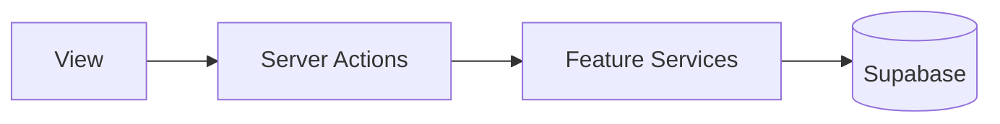

# System Architecture

- **Frontend:** Next.js 16 App Router, React 19. Pages under `app/`; shared UI in `components/`; feature-specific UI and logic in `features/`.
- **Controller layer:** Server actions in `app/actions/` create the Supabase client and call feature services. They do not touch the database directly.
- **Feature modules:** Each feature (dashboard, job-applications, checklist, resume, interview-questions) has types, services (data access), hooks, and components. Services receive the Supabase client from the caller.
- **Backend:** Supabase — Auth (email/password), Postgres (tables and RLS), Storage (resumes, cover-letters, avatars).
- **Request flow:** View (page or *Client.tsx) calls a server action; the action creates a client and calls a feature service; the service uses Supabase to read/write data; the action returns data or throws.

